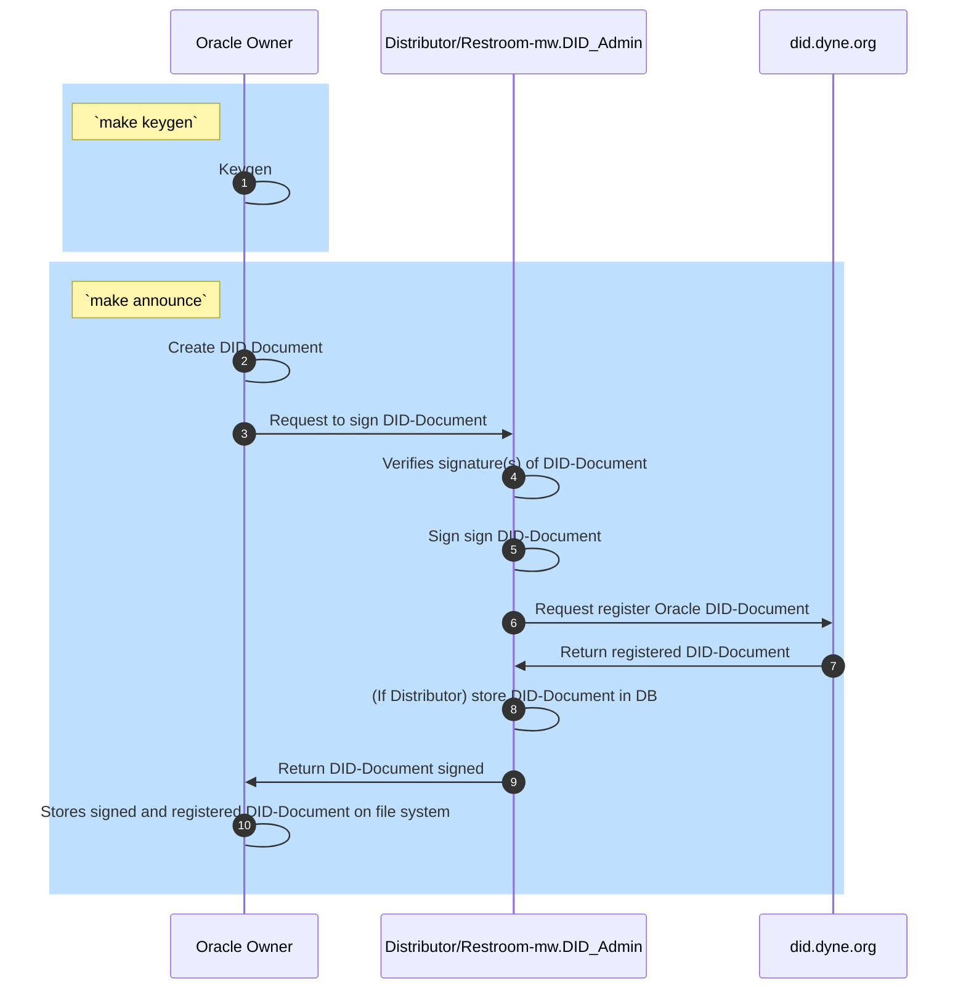
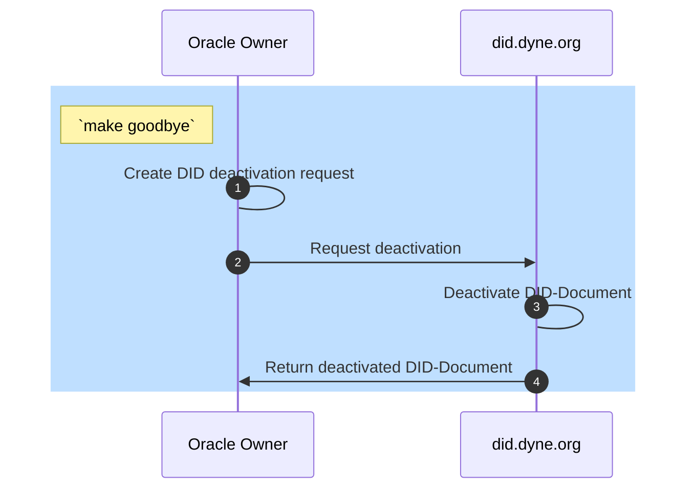

<p align="center">
  <h1>ZENSWARM ORACLE</h1>

  A zenswarm oracle is a web API whose identity is registered to a [DID controller](https://github.com/dyne/w3C-DID) and is able to run zencode smart contract (through [restroom-mw](https://github.com/dyne/restroom-mw)).

This repository contains some utilities that allow a user to
- generate a keyring (which defines the identity of the oracle)
- announce (i.e. register) the oracle to the DID controller
- run a express service which provides all of the restroom-mw middlewares
- deannounce (aka goodbye) the oracle identity

</p>

<div align="center">

# Zenswarm oracle

### Registered restroom-mw instance


</div>

<p align="center">
  <a href="https://dyne.org">
    
  </a>
</p>

## 🔨 Usage
Before using Zenswarm oracle you need:
* [Zenroom](https://zenroom.org/#downloads)
* Jq
* Docker

The `SECRET` directory will be shared with the zenswarm oracle container (by default is called `secrets`).
For example, this will let the oracle read the keyring we are going to generate.

The following commands also need a restroom instance with an Admin Keyring, you have to set the variables `RR_HOST`, `RR_PORT`, `RR_SCHEMA` and `RR_API` in the Makefile. To test the oracle you can use our apiroom instance with the following setting:
```
RR_PORT := 443
RR_HOST := apiroom.net
RR_SCHEMA := https
RR_API := W3CDID/create_sandbox_zenswarm_did.chain
```

The first step is to generate the keyring of the oracle
```bash
  make keygen DESCRIPTION="test oracle"
```
This command will generate a file `secrets/keys.json` with the newly created keyring.

Then, one has to announce the oracle to the DID controller. 
```bash
  make announce URL=`IP or FQDN`
```
This command will generate two files:
* `secrets/DID.json` with the the DID;
* `secrets/DID_document.json` with the the DID document and the DID document metadata;

At this point, one can run the oracle instance
```bash
  make build
  make run ORACLE_TYPE=common ORACLE_NAME=first-oracle
```
That will be launched on localhost on port 3000. To see the available contracts visit http://localhost:3000/docs.

To stop the container simply run
```
  make kill
```

Finally, once the oracle is no more needed, one have to deannounce the oracle to the DID controller.
```bash
  make goodbye
```

## Oracle Flow

### Distributor
First of all, you have to start a distributor. It will keep a list of announced oracles, it will announce new oracles and dsitribute a request at random.

One can start a distributor oracle using
```
make run ORACLE_TYPE=distributor
```

It will expose and API that will let other oracle announce.
During this phase it will have to:
1. record its domain name in redis;
1. authorize its public key (with a call to a smart contract);
1. (TODO: record its DID).

### Common
During startup it will have to announce to a distributor, by sending a JSON like
```
{
  "domain_name": "....",
  "address": "....",
  ....?
}
```
using the command
```
make announce
```

And can start the oracle with
```
make run ORACLE_TYPE=common
```

At this point, the node owner can submit the signature of its address to the Smart Contract

## 📝 Flows

### Announce flow



1. Oracle owner generates a private and public keys (SKs + PKs) via `make keygen`
1. Oracle owner creates DID-Document with PKs via `make announce`
1. Oracle owner request DID-Document signature and registration
1. Distributor/Restroom-mw.DID_Admin verifie signature(s) of DID-Document 
1. Distributor/Restroom-mw.DID_Admin signs DID-Document using DID.domain.context_A sk
1. Distributor/Restroom-mw.DID_Admin request did.dyne.org to registers DID-Document
1. did.dyne.org returns registered DID-Document
1. (If Distributor is acting) stores DID-Document on DB
1. Distributor/Restroom-mw.DID_Admin returns DID-Document to Oracle Owner
1. Oracle owner stores signed and registered DID-Document on file system

### Goodbye flow


### Distributor or Restroom mw Admin?
A DID Document has to be signed by an admin.
It is simple to setup a restroom instance which offers a contract to sign DID Document, it just need a DID Admin secret key.

One can also make an oracle offer the contract to sign DID Document, this kind of oracle is known as "Distributor".
One may decide to use a Distributor, instead of a simple restroom instance if he wants more features, e.g. being able to listen to websockets.

## 😍 Acknowledgements

<a href="https://dyne.org">
  
</a>

Copyleft (ɔ) 2023 by [Dyne.org](https://www.dyne.org) foundation, Amsterdam

Designed, written and maintained by [Denis Roio](https://github.com/jaromil), [Andrea D'Intino](https://github.com/andrea-dintino), [Alberto Lerda](https://github.com/albertolerda) and [Matteo Cristino](https://github.com/matteo-cristino).

## 💼 License

    Zenswarm oracle - Announced restroom-mw instance
    Copyleft (ɔ) 2023 Dyne.org foundation

    This program is free software: you can redistribute it and/or modify
    it under the terms of the GNU Affero General Public License as
    published by the Free Software Foundation, either version 3 of the
    License, or (at your option) any later version.

    This program is distributed in the hope that it will be useful,
    but WITHOUT ANY WARRANTY; without even the implied warranty of
    MERCHANTABILITY or FITNESS FOR A PARTICULAR PURPOSE.  See the
    GNU Affero General Public License for more details.

    You should have received a copy of the GNU Affero General Public License
    along with this program.  If not, see <http://www.gnu.org/licenses/>.
