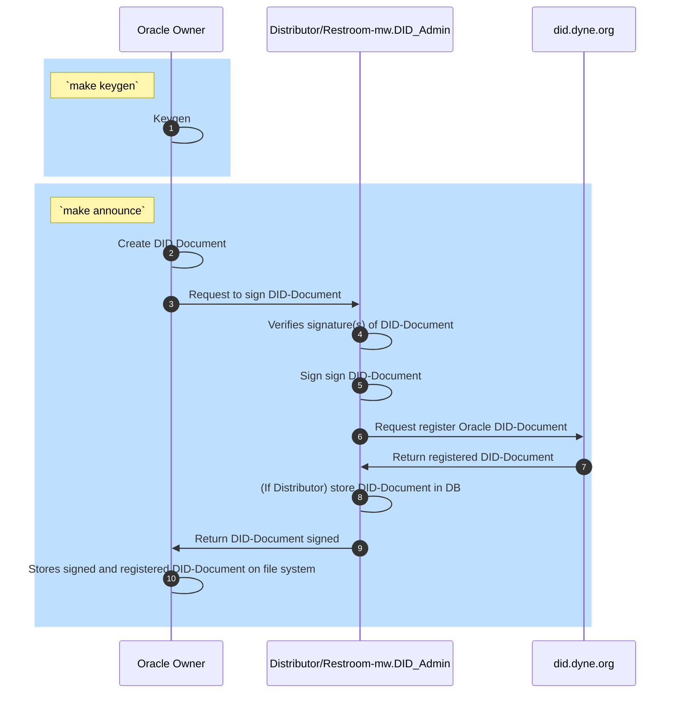
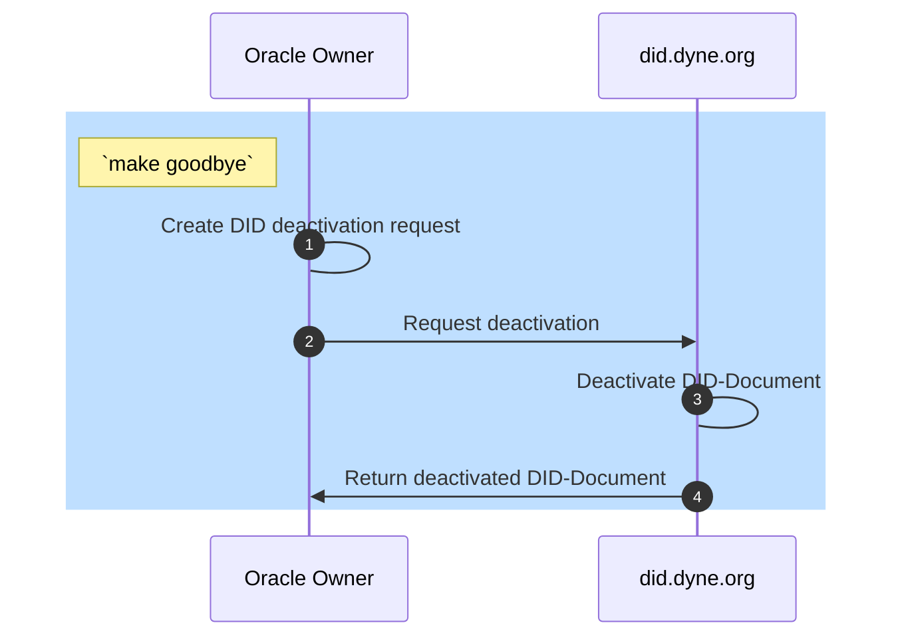

# Flows

## Announce flow

1. Oracle owner generates a private and public keys (SKs + PKs) via `make keygen`
1. Oracle owner creates DID-Document with PKs via `make announce`
1. Oracle owner request DID-Document signature and registration
1. Distributor/Restroom-mw.DID_Admin verifie signature(s) of DID-Document 
1. Distributor/Restroom-mw.DID_Admin signs DID-Document using DID.domain.context_A sk
1. Distributor/Restroom-mw.DID_Admin request did.dyne.org to registers DID-Document
1. did.dyne.org returns registered DID-Document
1. (If Distributor is acting) stores DID-Document on DB
1. Distributor/Restroom-mw.DID_Admin returns DID-Document to Oracle Owner
1. Oracle owner stores signed and registered DID-Document on file system

## Goodbye flow

## Distributor or Restroom mw Admin?
A DID Document has to be signed by an admin.
It is simple to setup a restroom instance which offers a contract to sign DID Document, it just need a DID Admin secret key.

One can also make an oracle offer the contract to sign DID Document, this kind of oracle is known as "Distributor".
One may decide to use a Distributor, instead of a simple restroom instance if he wants more features, e.g. being able to listen to websockets.
