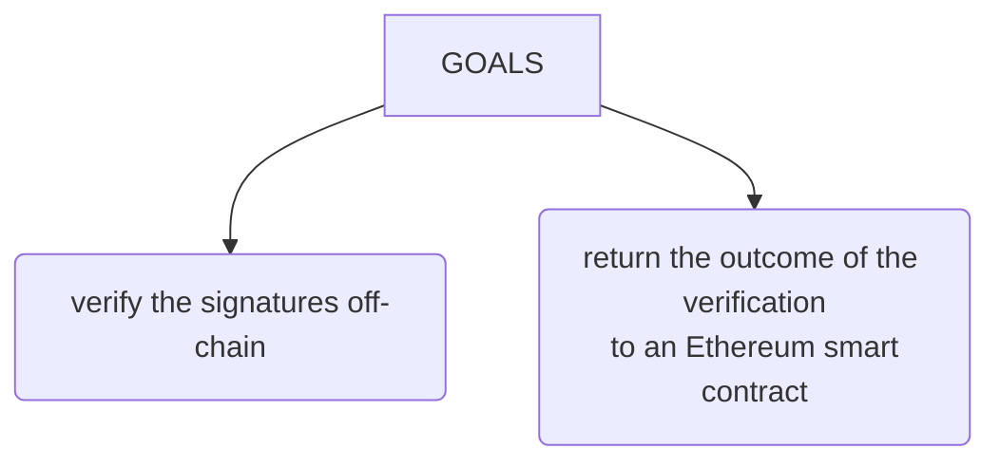
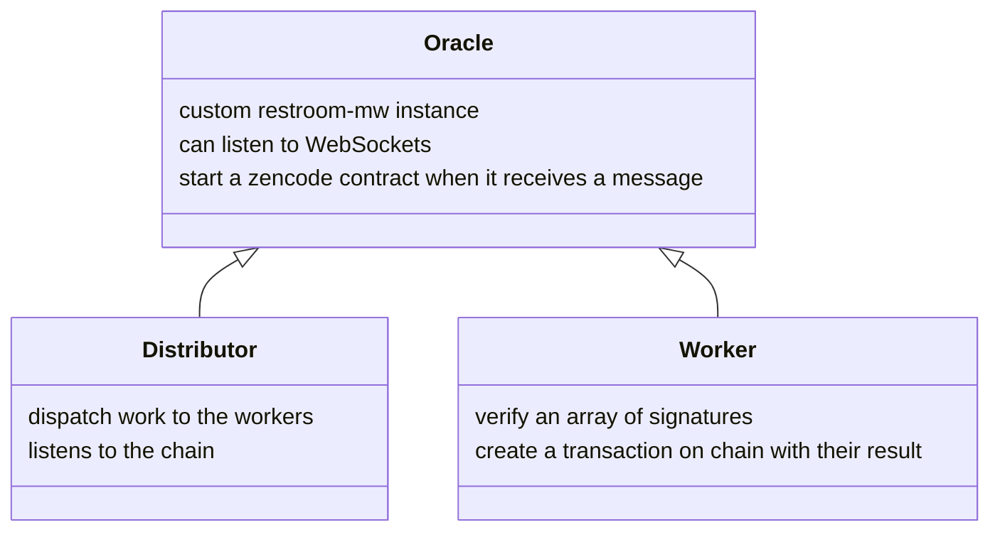
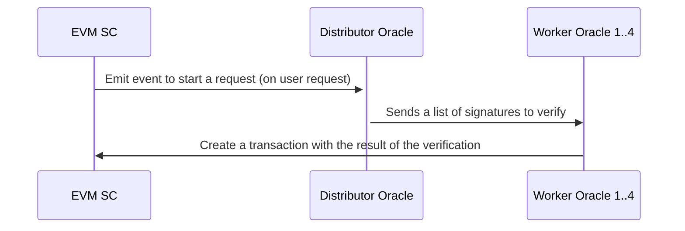

# Off-chain verification of multiple ethereum signaturs for a DAO 

A group of users make a poll, each users vote by creating the Ethereum signature of a message, the signature can be created from Metamask. An array of signatures (along with ethereum addresses of the signees) is stored on IPFS.

The goal is to: 
- verify the signatures off-chain (using Zenswarm oracles) 
- return the outcome of the verification to an Ethereum smart contract (also using Zenswarm oracles)

## Architecture

Zenswarm oracles are custom [restroom-mw](https://github.com/dyne/restroom-mw) instances, that can listen to WebSockets and start a zencode contract when they receive a message.

In this use case, we use two types of Zenswarm oracles:
- Distributor oracle: listens the chain and dispatch work to the workers. The distributor keeps a list of the approved and active Worker oracles
- Worker oracle: these verify an array of signatures and create a transaction on chain with their result
 
The following diagram shows the process:

The process starts when a user wants to verify a poll: 
1. the caller triggers the DAO ethereum smart contract (EVM SC) which emits an event. 
1. The Distributor oracle listens to all the topics (the events) and is activated when the designed event is emitted. 
1. The Distributer then chooses 4 Worker oracles randomly, by producing a veifiable random number, that results in the deterministic selection of the Worker oracles from the list: the determinism of the process is guaranteed by Zenroom.
1. Each Worker oracle then receives the array of signatures, that it will verify and return the results to call the EVM SC.

We can verify that the process is successful by asking the EVM SC.

## Couldn't we get the same result using just an Ethereum smart contract?
Yes, we could. Although, it would be extremely costly. The idea is to make the heavyweight work off-chain, using a group of random peer.

## How can a Worker oracle join the network?
Oracles have to be approved by the distributor and have to be linked (using a signature) to a ethereum address that have staked a certain amount of the designated DAO tokens.
The distributors keeps the list of approved worker oracles in a SQLite database.
