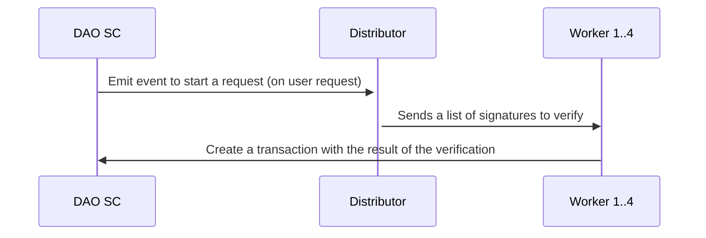

A group of users make a poll, each users vote and signs it. The list of signatures is stored on IPFS.
The goal is to save the outcome of the poll on chain, we will use oracles for this.

Zenswarm oracles are custom [restroom-mw](https://github.com/dyne/restroom-mw) instances, that can listen to WebSockets and start a zencode contract when they receive a message.

There are two kinds of oracles:
- worker: they will verify a list of signatures and create a transaction on chain with their result;
- distributor: it will listen the chain and dispatch work to the workers.

The following diagram shows the process:

The process starts when a user wants to verify a poll. The user calls the DAO SC which emits an event. One oracle distributor will be listening to the topic and he will choose 4 oracle randomly (using the determinism of zenroom).
Each oracle will receive the list of signatures, he will verify them and call the DAO SC.

We can verify that the process is successful by asking the DAO SC.

## Couldn't we get the same result using a SC?
Yes, we could. Although, it would be extremely costly. The idea is to make the heavyweight work off-chain, using a group of random peer.

## Can anyone become an oracle?
Oracles have to be approved by the distributor and have to be linked (using a signature) to a ethereum address that have staked some tokens.
The distributors keeps the list of approved worker oracles in a SQLite database.
